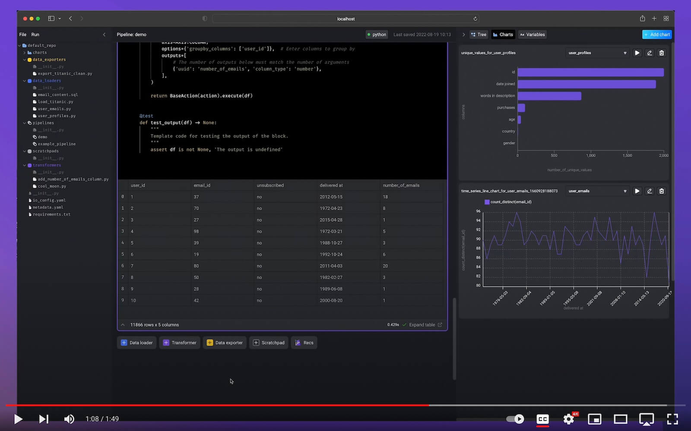

[](https://pypi.org/project/mage-ai/)
[](https://app.circleci.com/pipelines/github/mage-ai/mage-ai?branch=master&filter=all)
[](https://opensource.org/licenses/Apache-2.0)
[](https://join.slack.com/t/mageai/shared_invite/zt-1adn34w4m-t~TcnPTlo3~5~d_0raOp6A)

# Intro


Mage is an open-source tool for building and running data pipelines that <b>transform</b> your data.

<br />

<b>Here is a sample data pipeline defined across 3 files:</b>

```python
# data_loaders/load_data_from_file.py
import pandas as pd


@data_loader
def load_data():
    return pd.read_csv('default_repo/titanic.csv')
```

```python
# transformers/select_columns.py
@transformer
def transform_df(df, *args):
    return df[['Age', 'Fare', 'Survived']]
```

```python
# data_exporters/export_to_file.py
@data_exporter
def export_data(df) -> None:
    df.to_csv('default_repo/titanic_transformed.csv')
```

<br />

<b>What the data pipeline looks like in the UI:</b>


New? We recommend reading about [blocks](docs/blocks/README.md) and
learning from a [hands-on tutorial](docs/tutorials/quick_start/etl_restaurant/README.md).

<br />

[](https://www.mage.ai/chat)

## Table of contents

1. [Quick start](#%EF%B8%8F-quick-start)
1. [Demo](#-demo)
1. [Tutorials](#-tutorials)
1. [Core design principles](#%EF%B8%8F-core-design-principles)
1. [Features](#-features)
1. [Documentation](#-documentation)
1. [Contributing](#%EF%B8%8F-contributing)
1. [Community](#-community)

# 🏃‍♀️ Quick start

Install Mage using Docker or `pip`:

### Using Docker

Create a new project and launch tool (change `demo_project` to any other name if you want):

```bash
docker run -it -p 6789:6789 -v $(pwd):/home/src \
  mageai/mageai mage start demo_project
```

<sub>Follow the [guide](docs/kernels/README.md#pyspark-kernel-) if you want to use PySpark kernel in your notebook.</sub>

### Using pip

##### 1. Install Mage
```bash
pip install mage-ai
```

<sub>For additional packages (e.g. `spark`, `postgres`, etc), please see [Installing extra packages](docs/README.md#installing-extra-packages).</sub>

<sub>If you run into errors, please see [Install errors](docs/README.md#install-errors).</sub>

##### 2. Create new project and launch tool (change `demo_project` to any other name if you want):

```bash
mage start demo_project
```

### Open tool in browser

Open [http://localhost:6789](http://localhost:6789) in your browser and build a pipeline.

<br />

# 🎮 Demo

## Live demo

Try a hosted version of the tool here: [http://demo.mage.ai](http://demo.mage.ai/).

> WARNING
>
> The live demo is public, please don’t save anything sensitive.

## Demo video (2 min)

[](https://www.youtube.com/watch?v=hrsErfPDits "Mage quick start demo")

<sub><i>Click the image to play video</i></sub>

<br />

# 👩‍🏫 Tutorials

- [Train model on Titanic dataset](docs/tutorials/quick_start/train_titanic_model/README.md)
- [Load data from API, transform it, and export it to PostgreSQL](docs/tutorials/quick_start/etl_restaurant/README.md)
- [Integrate Mage into an existing Airflow project](docs/tutorials/airflow/integrate_into_existing_project/README.md)

<br />

# 🏔️ Core design principles

Every user experience and technical design decision adheres to these principles.

1. [Easy developer experience](docs/features/README.md#-easy-developer-experience)
1. [Engineering best practices built-in](docs/features/README.md#engineering-best-practices-built-in)
1. [Data is a first-class citizen](docs/features/README.md#data-is-a-first-class-citizen)
1. [Scaling made simple](docs/features/README.md#scaling-made-simple)

<br />

# 🔮 Features

- [Features overview](docs/features/README.md)
- [Roadmap](https://airtable.com/shrJS0cDOmQywb8vp)
- [Changelog](https://mageai.notion.site/What-s-new-7cc355e38e9c42839d23fdbef2dabd2c)

<br />

# 📚 Documentation

Read more docs [here](docs/README.md).

<br />

# 🙋‍♀️ Contributing

Check out the [🎁 contributing guide](/docs/contributing/README.md) to get started
by setting up your development environment and
exploring the code base.

<br />

# 🧙 Community
We love the community of Magers (`/ˈmājər/`);
a group of mages who help each other realize their full potential!

To live chat with the Mage team and community,
please join the free Mage [ Slack](https://www.mage.ai/chat)
channel.

[](https://www.mage.ai/chat)

For real-time news and fun memes, check out the Mage
[ Twitter](https://twitter.com/mage_ai).

To report bugs or add your awesome code for others to enjoy,
visit [GitHub](https://github.com/mage-ai/mage-ai).

<br />

# 🪪 License
See the [LICENSE](LICENSE) file for licensing information.

[](https://www.mage.ai/)
